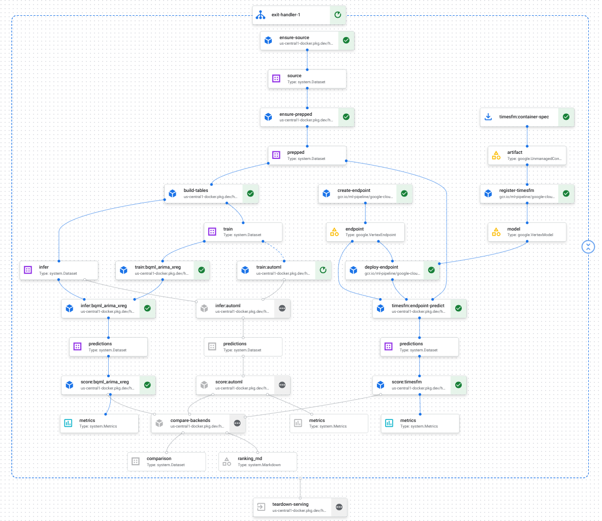

<div align="center">

<h1 align="center">🚲 geapTimes ⌛</h1>

> A modular factory framework for enterprise time-series forecasting with the **Gemini Enterprise Agent Platform** (GEAP, *fka Vertex AI*)


</div>

The `ForecastFactory` creates model experiments for GEAP's [AutoML](https://docs.cloud.google.com/gemini-enterprise-agent-platform/machine-learning/tabular-data/overview#forecasting), Google Research's [TimesFM](https://research.google/blog/a-decoder-only-foundation-model-for-time-series-forecasting/), and BigQuery ML's [ARIMA+ & ARIMA+XREG](https://docs.cloud.google.com/bigquery/docs/forecasting-overview). Experiments are defined in **YAML** and validated into **Pydantic** config. Runs
are tracked as platform Experiments with a Design-of-Experiments (DOE) matrix.

> Refactor of the notebook-based [`vertex-forecas-repo`](https://github.com/tottenjordan/vertex-forecas-repo)
> into a packaged framework. Built in staged milestones — see [PLANS.md](./PLANS.md).

## Data

- **Target:** daily trips per station — `COUNT(*)` of Citibike trips grouped by
  `start_station_name` and day (top-25 stations by volume).
- **Covariates:** NOAA GSOD weather (temp, precip), calendar features, and station metadata.
- Source: `bigquery-public-data` (Citibike + NOAA GSOD). See
  [docs/notes](./docs/notes/forecasting-covariate-and-model-constraints.md) for the covariate
  taxonomy and per-model constraints.

## Pipeline

The comparison pipeline orchestrates the `ForecastFactory` on **Vertex AI Pipelines** (KFP). It runs
every backend through a uniform **train → infer → score** chain that feeds **one shared scorer**, so a
single ranking is produced from identical metrics across all models:

- **`ForecastFactory`** builds the typed `Forecaster` for each enabled backend (AutoML, BQML, TimesFM).
  Backend heterogeneity lives *inside* the forecaster — the DAG stays uniform.
- **Train → infer split** passes the trained model as an artifact between steps, so an inference-side
  failure re-uses the cached trained model instead of re-running a multi-hour training job.
- **Hybrid serving** — TimesFM is served via **Google Cloud Pipeline Components** (managed
  upload/endpoint/deploy infra) wrapped by **custom components** that own all forecasting logic and
  experiment tracking; AutoML and BQML stay custom SDK-wrapper components.
- **Self-cleaning** — the transient TimesFM endpoint is torn down by a `dsl.ExitHandler` on both
  success and failure, so no serving infra is stranded.
- Each backend's run is logged as a **Vertex AI Experiment** run, and a final `compare-backends` step
  emits the ranked comparison artifact (winner by MAE/RMSE).

See [CODE_STANDARDS.md](./CODE_STANDARDS.md#pipeline-components--gcpc-vs-custom-hybrid-serving) for the
GCPC-vs-custom component split.

<details>
<summary>📊 Pipeline DAG — Vertex AI console view (click to expand)</summary>

<br>



</details>

## Tech stack

- Python **3.11**, **`uv`** for packaging, **`ruff`** + **`ty`** + **`pytest`**.
- `google-cloud-aiplatform==1.158.0`, `timesfm[torch]==2.0.1` (loads the TimesFM **2.5** model).

## Quickstart

```bash
uv sync --all-groups          # create env + install deps
uv run ruff check .           # lint
uv run ty check               # type-check
uv run pytest                 # tests
```

See [CODE_STANDARDS.md](./CODE_STANDARDS.md) for the full development workflow.

## Notebooks (standardized kernel)

Notebooks run on a shared, reproducible Jupyter kernel backed by the project's `uv` venv:

```bash
# one-time per machine: register the kernel
uv run python -m ipykernel install --user --name geaptimes --display-name "geapTimes (uv 3.11)"
uv run jupyter lab            # notebooks auto-select the "geaptimes" kernel
```

The notebooks reference this kernel by name (`geaptimes`), so everyone runs the same env.

## GCP setup

```bash
cp .env.example .env          # defaults GCP_PROJECT=hybrid-vertex
set -a; source .env; set +a
gcloud auth application-default login
uv run python scripts/setup_gcp.py --config config/base_config.yaml --dry-run
```

> Want zero-setup sharing instead? The notebooks can be made Colab-friendly by adding a guarded
> first cell that `pip install`s the package and runs `google.colab.auth` — see CODE_STANDARDS.

## Repository structure

```
geapTimes/
├── config/
│   └── base_config.yaml              # the YAML experiment definition (validated into typed config)
├── src/geaptimes/                    # the installable package
│   ├── schemas.py                    # Pydantic v2 models — the typed config contract
│   ├── naming.py                     # deterministic dataset/table/model/bucket names
│   ├── constants.py                  # shared constants (resource labels, quantiles, …)
│   ├── gcp.py                        # GCP client/session helpers
│   ├── data/
│   │   └── queries.py                # BigQuery prep/train/infer SQL builders
│   ├── models/                       # the model factory + forecaster backends
│   │   ├── base.py                   # Forecaster ABC, ForecastResult, column constants
│   │   ├── factory.py                # ForecastFactory.from_config -> list[Forecaster]
│   │   ├── timesfm.py                # TimesFM 2.5 (in-process)
│   │   ├── bqml.py                   # BigQuery ML ARIMA_PLUS_XREG (server-side SQL)
│   │   └── automl.py                 # Vertex AutoML Forecasting (managed job; default-off)
│   ├── experiment/                   # the experiment-tracking + DOE harness
│   │   ├── doe.py                    # Design-of-Experiments matrix expansion
│   │   ├── metrics.py                # point metrics (MAE/RMSE) vs TEST actuals
│   │   ├── tracking.py               # Vertex AI Experiments + GCS artifact sink
│   │   └── runner.py                 # run_experiment: DOE × models -> tracked runs
│   └── utils/
│       └── logger.py                 # structured logging
├── data_notebooks/                   # demo notebooks (shared `geaptimes` kernel)
│   ├── 01_citibike_prep.ipynb        # data exploration & prep
│   ├── 02_timesfm_local.ipynb        # local TimesFM forecasting
│   └── 03_experiment_tracking.ipynb  # DOE + experiment-tracking demo
├── scripts/                          # GCP setup + standalone demos
│   ├── setup_gcp.py                  # provision datasets/buckets/labels
│   └── demo_timesfm.py
├── tests/                            # pytest suite (offline; cloud seams injected)
├── docs/
│   ├── plans/                        # immutable approved per-stage plans
│   ├── notes/                        # durable cross-session design notes
│   └── media/                        # README/doc images
├── PLANS.md                          # living roadmap + active-stage tracker
├── CODE_STANDARDS.md                 # authoritative tooling/layout/commit policy
└── pyproject.toml                    # uv-managed project + tool config
```

## Documentation & references

**Platform & models**

- **GEAP / Vertex AI AutoML Forecasting** —
  [overview](https://docs.cloud.google.com/gemini-enterprise-agent-platform/machine-learning/tabular-data/forecasting/overview)
- **BigQuery ML forecasting** —
  [overview](https://docs.cloud.google.com/bigquery/docs/forecasting-overview) ·
  [`ARIMA_PLUS_XREG` model syntax](https://docs.cloud.google.com/bigquery/docs/reference/standard-sql/bigqueryml-syntax-create-time-series) ·
  [multivariate forecasting tutorial](https://docs.cloud.google.com/bigquery/docs/arima-plus-xreg-single-time-series-forecasting-tutorial)
- **TimesFM 2.5** —

  - [GEAP Model Card](https://pantheon.corp.google.com/agent-platform/publishers/google/model-garden/timesfm?e=13802955&mods=-ai_platform_fake_service,-ai_platform_staging_service&project=hybrid-vertex)
  - [HuggingFace Model Card](https://huggingface.co/google/timesfm-2.5-200m-pytorch)
  ·
  [GitHub repo](https://github.com/google-research/timesfm)
- **Vertex AI Experiments** (run tracking / params / metrics) —
  [docs](https://docs.cloud.google.com/vertex-ai/docs/experiments/intro-vertex-ai-experiments)
- **Public datasets** —
  [Citibike trips](https://console.cloud.google.com/marketplace/details/city-of-new-york/nyc-citi-bike) ·
  [NOAA GSOD weather](https://console.cloud.google.com/marketplace/details/noaa-public/gsod)

**Tooling**

- [`uv`](https://docs.astral.sh/uv/) packaging ·
  [`ruff`](https://docs.astral.sh/ruff/) lint+format ·
  [`ty`](https://github.com/astral-sh/ty) type checker ·
  [Pydantic v2](https://docs.pydantic.dev/latest/) ·
  [pytest](https://docs.pytest.org/)
